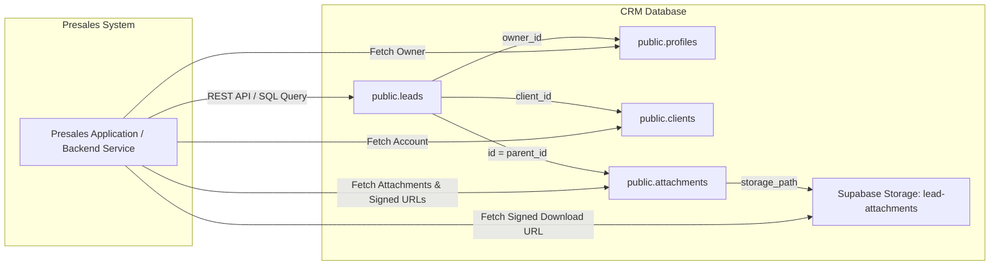

# CRM Lead Integration Guide for Presales System (`presalesdata.md`)

This guide provides technical specifications, database schemas, SQL queries, REST API endpoints, and client code implementations to fetch **CRM Leads**, **Lead Owners**, **Related Account/Client Details**, and **Related Documents** into the **Presales System**.

---

## 1. Overview & Architecture

The CRM system utilizes a **Supabase (PostgreSQL + PostgREST)** architecture. The Presales system can access CRM lead data either via direct PostgreSQL connections (or DB views) or via secure REST API / Supabase Client calls.



---

## 2. Data Models & Database Schemas

### 2.1 Lead Information (`public.leads`)
Stores core lead details, stage/status, commercial value, deal probability, and location.

| Column | Type | Constraints | Description |
| :--- | :--- | :--- | :--- |
| `id` | `uuid` | `PRIMARY KEY`, `DEFAULT gen_random_uuid()` | Unique identifier for the lead |
| `code` | `text` | `UNIQUE` | Human-readable lead code (e.g., `L-1042`) |
| `client_id` | `uuid` | `REFERENCES public.clients(id)` | Foreign key to the related Client / Account |
| `company_en` | `text` | `NOT NULL` | Company / Account English name |
| `company_ar` | `text` | Optional | Company / Account Arabic name |
| `contact_name_en` | `text` | Optional | Primary contact person (English) |
| `contact_name_ar` | `text` | Optional | Primary contact person (Arabic) |
| `email` | `text` | Optional | Primary contact email |
| `phone` | `text` | Optional | Primary contact phone number |
| `source_en` | `text` | Optional | Lead acquisition source (e.g., Referral, Website) |
| `source_ar` | `text` | Optional | Lead source in Arabic |
| `industry_en` | `text` | Optional | Industry classification (English) |
| `industry_ar` | `text` | Optional | Industry classification (Arabic) |
| `status` | `enum` | `NOT NULL`, Default: `'new'` | Enum: `'new'`, `'contacted'`, `'qualified'`, `'proposal'`, `'negotiation'`, `'won'`, `'lost'`, `'pending_won_approval'` |
| `owner_id` | `uuid` | `REFERENCES public.profiles(id)` | Foreign key to the assigned CRM Lead Owner |
| `value` | `numeric(14,2)`| Default `0.00` | Estimated deal value (monetary) |
| `probability` | `integer` | `0` to `100` | Deal win probability percentage |
| `expected_close_date` | `date` | Optional | Target closing date |
| `tag` | `text` | Optional | Categorization tag (e.g., `Urgent`, `Enterprise`) |
| `city_en` / `city_ar` | `text` | Optional | Location city |
| `district_en` / `district_ar`| `text` | Optional | Location district |
| `street_en` / `street_ar` | `text` | Optional | Location street address |
| `lat` / `lng` | `numeric(9,6)`| Optional | Geographic coordinates |
| `project_id` | `uuid` | `REFERENCES public.projects(id)` | Linked project ID if converted |
| `created_by` | `uuid` | Optional | Auth user ID of the creator |
| `created_at` | `timestamptz`| `DEFAULT now()` | Creation timestamp |
| `updated_at` | `timestamptz`| `DEFAULT now()` | Last update timestamp |

---

### 2.2 Owner Information (`public.profiles`)
Represents the employee/sales team member owning the lead.

| Column | Type | Constraints | Description |
| :--- | :--- | :--- | :--- |
| `id` | `uuid` | `PRIMARY KEY` | Profile ID (referenced by `leads.owner_id`) |
| `user_id` | `uuid` | `NOT NULL`, `UNIQUE` | References `auth.users(id)` |
| `full_name_en` | `text` | `NOT NULL` | Employee full name (English) |
| `full_name_ar` | `text` | Optional | Employee full name (Arabic) |
| `email` | `text` | `NOT NULL`, `UNIQUE` | Employee work email address |
| `phone` | `text` | Optional | Contact phone |
| `title_en` / `title_ar` | `text` | Optional | Job title (e.g. Presales Lead, Account Executive) |
| `department_en` / `department_ar` | `text` | Optional | Department (e.g., Sales, Presales) |
| `location_en` / `location_ar` | `text` | Optional | Office location |
| `avatar_url` | `text` | Optional | Profile image URL |
| `manager_id` | `uuid` | `REFERENCES public.profiles(id)` | Reporting manager's profile ID |
| `active` | `boolean` | `DEFAULT true` | Account status flag |

---

### 2.3 Account Information (`public.clients` & `public.registered_accounts`)
Stores corporate client / account info linked to the lead via `leads.client_id`.

| Column | Type | Description |
| :--- | :--- | :--- |
| `id` | `uuid` | Account ID (referenced by `leads.client_id`) |
| `name_en` | `text` | Registered company name (English) |
| `name_ar` | `text` | Registered company name (Arabic) |
| `industry_en` / `industry_ar` | `text` | Industry sector |
| `contact_name_en` / `contact_name_ar` | `text` | Account manager or key stakeholder |
| `email` | `text` | Corporate email address |
| `phone` | `text` | Corporate contact phone number |
| `city_en` / `district_en` / `street_en` | `text` | Physical billing/office address details |
| `notes` | `text` | Account background notes |

*Note: Enterprise registered accounts may also be referenced in `public.registered_accounts(id, name, type, owner)`.*

---

### 2.4 Related Documents (`public.attachments` & Supabase Storage)
Files (RFPs, Specifications, Technical Requirements, Proposals) attached to the lead.

| Column | Type | Constraints | Description |
| :--- | :--- | :--- | :--- |
| `id` | `uuid` | `PRIMARY KEY` | Attachment ID |
| `parent_table` | `text` | `CHECK (parent_table IN ('lead','project','quotation','activity'))` | Must equal `'lead'` for lead files |
| `parent_id` | `uuid` | `NOT NULL` | Foreign key matching `leads.id` |
| `name_en` | `text` | `NOT NULL` | Display file name (e.g. `Technical_RFP_v2.pdf`) |
| `storage_path` | `text` | `NOT NULL` | Relative path inside bucket (e.g. `{user_id}/{lead_id}/{timestamp}-{filename}`) |
| `mime` | `text` | Optional | MIME type (e.g. `application/pdf`, `image/png`) |
| `size_bytes` | `bigint` | Optional | File size in bytes |
| `uploaded_by` | `uuid` | Optional | Profile ID of uploader |
| `created_at` | `timestamptz`| `DEFAULT now()` | Upload timestamp |

**Storage Bucket Specification:**
- **Bucket Name:** `lead-attachments`
- **Allowed Formats:** PDF, PNG, JPG, JPEG
- **Max File Size:** 3 MB
- **Access Control:** Requires signed URLs for downloading/viewing secure documents.

---

## 3. Database SQL Queries

### 3.1 Single Query (Fetch Lead + Owner + Account + Attachments)
Use this query in backend services or SQL views to fetch comprehensive lead data in a single database round-trip:

```sql
SELECT 
    -- Lead Details
    l.id AS lead_id,
    l.code AS lead_code,
    l.company_en AS lead_company_name,
    l.contact_name_en AS lead_contact_name,
    l.email AS lead_email,
    l.phone AS lead_phone,
    l.source_en AS lead_source,
    l.industry_en AS lead_industry,
    l.status AS lead_status,
    l.value AS lead_value,
    l.probability AS lead_probability,
    l.expected_close_date,
    l.tag AS lead_tag,
    l.city_en AS lead_city,
    l.district_en AS lead_district,
    l.street_en AS lead_street,
    l.created_at AS lead_created_at,

    -- Owner Details (profiles)
    jsonb_build_object(
        'id', p.id,
        'full_name', p.full_name_en,
        'title', p.title_en,
        'department', p.department_en,
        'email', p.email,
        'phone', p.phone,
        'avatar_url', p.avatar_url
    ) AS owner_info,

    -- Related Account Details (clients)
    jsonb_build_object(
        'id', c.id,
        'name', c.name_en,
        'industry', c.industry_en,
        'contact_name', c.contact_name_en,
        'email', c.email,
        'phone', c.phone,
        'city', c.city_en,
        'notes', c.notes
    ) AS account_info,

    -- Related Documents (attachments)
    COALESCE(
        (
            SELECT jsonb_agg(
                jsonb_build_object(
                    'id', a.id,
                    'name', a.name_en,
                    'storage_path', a.storage_path,
                    'mime', a.mime,
                    'size_bytes', a.size_bytes,
                    'created_at', a.created_at
                )
            )
            FROM public.attachments a
            WHERE a.parent_table = 'lead' AND a.parent_id = l.id
        ),
        '[]'::jsonb
    ) AS related_documents

FROM public.leads l
LEFT JOIN public.profiles p ON l.owner_id = p.id
LEFT JOIN public.clients c ON l.client_id = c.id
WHERE l.id = 'YOUR_LEAD_UUID_HERE';
```

---

### 3.2 SQL View Creation (`vw_presales_leads`)
Execute this patch on PostgreSQL to expose a clean view for Presales applications:

```sql
CREATE OR REPLACE VIEW public.vw_presales_leads AS
SELECT 
    l.id AS lead_id,
    l.code AS lead_code,
    l.company_en AS company_name,
    l.contact_name_en AS contact_name,
    l.email AS lead_email,
    l.phone AS lead_phone,
    l.status AS lead_status,
    l.value AS lead_value,
    l.probability AS lead_probability,
    l.expected_close_date,
    l.owner_id,
    p.full_name_en AS owner_name,
    p.email AS owner_email,
    p.title_en AS owner_title,
    l.client_id AS account_id,
    c.name_en AS account_name,
    c.industry_en AS account_industry,
    l.created_at,
    l.updated_at
FROM public.leads l
LEFT JOIN public.profiles p ON l.owner_id = p.id
LEFT JOIN public.clients c ON l.client_id = c.id;
```

---

## 4. REST API & PostgREST Endpoints

The CRM exposes direct HTTP REST endpoints via PostgREST.

### 4.1 Base URL & Headers
- **Base URL:** `https://<your-supabase-project-id>.supabase.co/rest/v1`
- **Required Headers:**
  - `apikey`: `<YOUR_SUPABASE_ANON_KEY_OR_SERVICE_ROLE_KEY>`
  - `Authorization`: `Bearer <USER_JWT_TOKEN>`
  - `Content-Type`: `application/json`

---

### 4.2 Fetch Lead with Owner, Account, and Attachments in One Request
PostgREST allows resource embedding using the `select` query parameter:

#### **HTTP Request:**
```http
GET /rest/v1/leads?select=id,code,company_en,contact_name_en,email,phone,status,value,probability,expected_close_date,tag,city_en,owner:profiles!owner_id(id,full_name_en,title_en,email,phone,avatar_url),account:clients!client_id(id,name_en,industry_en,email,phone),attachments:attachments!parent_id(id,name_en,storage_path,mime,size_bytes,created_at)&id=eq.11111111-2222-3333-4444-555555555555 HTTP/1.1
Host: <your-supabase-project-id>.supabase.co
apikey: <SUPABASE_KEY>
Authorization: Bearer <JWT_TOKEN>
```

#### **cURL Example:**
```bash
curl -X GET "https://<your-supabase-project-id>.supabase.co/rest/v1/leads?select=*,owner:profiles!owner_id(*),account:clients!client_id(*),attachments:attachments!parent_id(*)&id=eq.YOUR_LEAD_UUID" \
  -H "apikey: YOUR_SUPABASE_KEY" \
  -H "Authorization: Bearer YOUR_JWT_TOKEN"
```

#### **Sample JSON Response:**
```json
[
  {
    "id": "c7a84b12-9011-4e8a-b851-fa7b2a92c300",
    "code": "L-1042",
    "company_en": "Integrated Technics Solutions",
    "contact_name_en": "Ahmed Hassan",
    "email": "ahmed.hassan@intechnics.com",
    "phone": "+201012345678",
    "status": "proposal",
    "value": 250000.00,
    "probability": 75,
    "expected_close_date": "2026-09-30",
    "tag": "Enterprise",
    "city_en": "Cairo",
    "owner": {
      "id": "e932b110-3344-5566-7788-9900aabbccdd",
      "full_name_en": "Tarek Mahmoud",
      "title_en": "Senior Account Executive",
      "department_en": "Commercial Sales",
      "email": "tarek.mahmoud@crmcompany.com",
      "phone": "+201009876543",
      "avatar_url": "https://example.com/avatars/tarek.jpg"
    },
    "account": {
      "id": "8f7e6d5c-4b3a-2109-8765-4321fedcba09",
      "name_en": "Integrated Technics Solutions",
      "industry_en": "Information Technology",
      "email": "info@intechnics.com",
      "phone": "+20227654321"
    },
    "attachments": [
      {
        "id": "f5e4d3c2-b1a0-9988-7766-554433221100",
        "name_en": "Integrated_Technics_RFP_Spec.pdf",
        "storage_path": "user_123/c7a84b12-9011-4e8a-b851-fa7b2a92c300/1722790000-Integrated_Technics_RFP_Spec.pdf",
        "mime": "application/pdf",
        "size_bytes": 1450200,
        "created_at": "2026-08-04T12:00:00Z"
      }
    ]
  }
]
```

---

### 4.3 Generating Signed File Download URLs for Presales Documents
Because documents are stored in the private `lead-attachments` bucket, request a temporary pre-signed URL before opening/downloading:

#### **HTTP Request:**
```http
POST /storage/v1/object/sign/lead-attachments/user_123/c7a84b12-9011-4e8a-b851-fa7b2a92c300/1722790000-Integrated_Technics_RFP_Spec.pdf HTTP/1.1
Host: <your-supabase-project-id>.supabase.co
apikey: <SUPABASE_KEY>
Authorization: Bearer <JWT_TOKEN>
Content-Type: application/json

{
  "expiresIn": 3600
}
```

#### **cURL Example:**
```bash
curl -X POST "https://<your-supabase-project-id>.supabase.co/storage/v1/object/sign/lead-attachments/YOUR_STORAGE_PATH" \
  -H "apikey: YOUR_SUPABASE_KEY" \
  -H "Authorization: Bearer YOUR_JWT_TOKEN" \
  -H "Content-Type: application/json" \
  -d '{"expiresIn": 3600}'
```

#### **Response:**
```json
{
  "signedURL": "/storage/v1/object/sign/lead-attachments/YOUR_STORAGE_PATH?token=eyJhbGciOi..."
}
```

Full download link = `https://<your-supabase-project-id>.supabase.co` + `signedURL`.

---

## 5. Client Code Implementation Examples

### 5.1 TypeScript / JavaScript (Supabase SDK)

Here is a production-ready module to use inside your Presales frontend or Node.js service:

```typescript
import { createClient } from '@supabase/supabase-js';

const SUPABASE_URL = process.env.SUPABASE_URL || 'https://<your-project-id>.supabase.co';
const SUPABASE_ANON_KEY = process.env.SUPABASE_ANON_KEY || 'your-anon-key';

export const supabase = createClient(SUPABASE_URL, SUPABASE_ANON_KEY);

export interface PresalesLeadData {
  id: string;
  code: string | null;
  company_en: string;
  contact_name_en: string | null;
  email: string | null;
  phone: string | null;
  status: string;
  value: number;
  probability: number;
  expected_close_date: string | null;
  tag: string | null;
  owner: {
    id: string;
    full_name_en: string;
    email: string;
    title_en: string | null;
    department_en: string | null;
    avatar_url: string | null;
  } | null;
  account: {
    id: string;
    name_en: string;
    industry_en: string | null;
    email: string | null;
  } | null;
  documents: Array<{
    id: string;
    name: string;
    mime: string | null;
    sizeBytes: number | null;
    signedUrl: string | null;
    createdAt: string;
  }>;
}

/**
 * Fetches comprehensive lead data for the Presales System
 * @param leadId Lead UUID or Code
 */
export async function getPresalesLeadData(leadId: string): Promise<PresalesLeadData | null> {
  const isUuid = /^[0-9a-f]{8}-[0-9a-f]{4}-[0-9a-f]{4}-[0-9a-f]{4}-[0-9a-f]{12}$/i.test(leadId);
  const column = isUuid ? 'id' : 'code';

  // 1. Fetch Lead with Owner and Client relations
  const { data: lead, error } = await supabase
    .from('leads')
    .select(`
      id,
      code,
      company_en,
      contact_name_en,
      email,
      phone,
      status,
      value,
      probability,
      expected_close_date,
      tag,
      owner:profiles!owner_id (
        id,
        full_name_en,
        email,
        title_en,
        department_en,
        avatar_url
      ),
      account:clients!client_id (
        id,
        name_en,
        industry_en,
        email
      )
    `)
    .eq(column, leadId)
    .single();

  if (error || !lead) {
    console.error('[Presales Integration] Failed to fetch lead:', error);
    return null;
  }

  // 2. Fetch Lead Attachments
  const { data: rawAttachments } = await supabase
    .from('attachments')
    .select('id, name_en, storage_path, mime, size_bytes, created_at')
    .eq('parent_table', 'lead')
    .eq('parent_id', lead.id)
    .order('created_at', { ascending: false });

  // 3. Generate Signed Download URLs for each document
  const documents = await Promise.all(
    (rawAttachments || []).map(async (att) => {
      let signedUrl: string | null = null;
      if (att.storage_path) {
        const { data: signData } = await supabase.storage
          .from('lead-attachments')
          .createSignedUrl(att.storage_path, 3600); // 1 hour validity
        signedUrl = signData?.signedUrl ?? null;
      }

      return {
        id: att.id,
        name: att.name_en,
        mime: att.mime,
        sizeBytes: att.size_bytes,
        signedUrl,
        createdAt: att.created_at,
      };
    })
  );

  return {
    id: lead.id,
    code: lead.code,
    company_en: lead.company_en,
    contact_name_en: lead.contact_name_en,
    email: lead.email,
    phone: lead.phone,
    status: lead.status,
    value: lead.value ?? 0,
    probability: lead.probability ?? 0,
    expected_close_date: lead.expected_close_date,
    tag: lead.tag,
    owner: (lead as any).owner ?? null,
    account: (lead as any).account ?? null,
    documents,
  };
}
```

---

### 5.2 Python Client Example

```python
import os
import requests
from supabase import create_client, Client

SUPABASE_URL = os.environ.get("SUPABASE_URL", "https://<your-project-id>.supabase.co")
SUPABASE_KEY = os.environ.get("SUPABASE_ANON_KEY", "your-anon-key")

supabase: Client = create_client(SUPABASE_URL, SUPABASE_KEY)

def get_presales_lead(lead_id: str):
    # Fetch lead + owner + account
    response = supabase.table("leads").select(
        "*, owner:profiles!owner_id(*), account:clients!client_id(*)"
    ).eq("id", lead_id).execute()

    if not response.data:
        return None

    lead = response.data[0]

    # Fetch attachments
    att_resp = supabase.table("attachments").select("*").eq("parent_table", "lead").eq("parent_id", lead_id).execute()
    attachments = att_resp.data or []

    # Generate signed download URLs
    docs = []
    for att in attachments:
        path = att.get("storage_path")
        signed_res = supabase.storage.from_("lead-attachments").create_signed_url(path, 3600)
        signed_url = signed_res.get("signedURL") if isinstance(signed_res, dict) else getattr(signed_res, "signed_url", None)
        
        docs.append({
            "id": att.get("id"),
            "name": att.get("name_en"),
            "mime": att.get("mime"),
            "size_bytes": att.get("size_bytes"),
            "signed_url": signed_url
        })

    lead["documents"] = docs
    return lead
```

---

## 6. Real-time Lead Updates for Presales

To auto-update the Presales dashboard whenever lead status or details change, subscribe to real-time database changes:

```typescript
import { supabase } from './supabaseClient';

export function subscribeToLeadUpdates(leadId: string, onUpdate: (updatedLead: any) => void) {
  const channel = supabase
    .channel(`presales-lead-${leadId}`)
    .on(
      'postgres_changes',
      {
        event: 'UPDATE',
        schema: 'public',
        table: 'leads',
        filter: `id=eq.${leadId}`,
      },
      (payload) => {
        console.log('[Presales] Lead updated in real-time:', payload.new);
        onUpdate(payload.new);
      }
    )
    .subscribe();

  return () => {
    supabase.removeChannel(channel);
  };
}
```

---

## 7. Security, RLS & Best Practices

1. **Row Level Security (RLS):** Ensure the JWT passed in `Authorization: Bearer <TOKEN>` belongs to an authenticated user with permissions to view leads.
2. **Signed URL Expiration:** Signed URLs generated for attachments should expire after a reasonable timeout (e.g. 1 hour = 3600 seconds). Do not store signed URLs permanently; regenerate them on demand.
3. **Bilingual Fallbacks:** When presenting lead or client data, fallback to `name_en` or `company_en` if `name_ar` / `company_ar` is missing.
4. **Presales Handover Status:** When a lead transitions to `'proposal'` or `'qualified'`, automatically trigger presales resource assignment and document sync.
